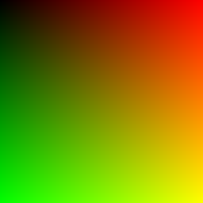
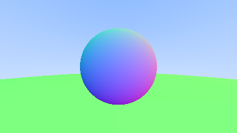
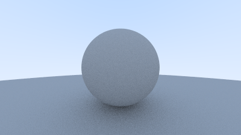

# Overview

Hi there! This is a Rust implementation of a ray tracer based on the [Ray Tracing in One Weekend](https://raytracing.github.io/books/RayTracingInOneWeekend.html) tutorial.

Feel free to share feedback or comments.

## Part 1

Here is the first rendered image:

The original PPM output is available at [here](images/image_1.ppm) or [there](images/image_2.ppm).

## Part 2

Here is the scene with a new *ray* entity, a *viewport* through which the scene rays pass, a *pixel grid* on the viewport, and a *camera*, which is the point in 3D space from which all scene rays originate.

## Part 3

Let's add a sphere. We will use a unit vector for the normals. And the color of a sphere now depends on a point where a hit happened.

## Part 4

The scene now uses a shared *hittable* interface, so objects (spheres in our case) can be tested for ray intersections in a common way. A *hittable list* stores the scene objects and keeps the closest hit, while an *interval* limits which ray hits are valid. This lets us add a second large sphere as the ground while preserving the normal-based coloring from the previous step.

## Part 5

Now we're added antialiasing for out scene.

## Part 6

Now the scene has diffuse lighting. Rays are reflected in directions following the Lambert distribution, and the camera limits the number of bounces with a maximum depth so the render always finishes. We also shift the valid hit interval slightly away from zero to avoid shadow acne, and apply gamma correction before writing the final color.

